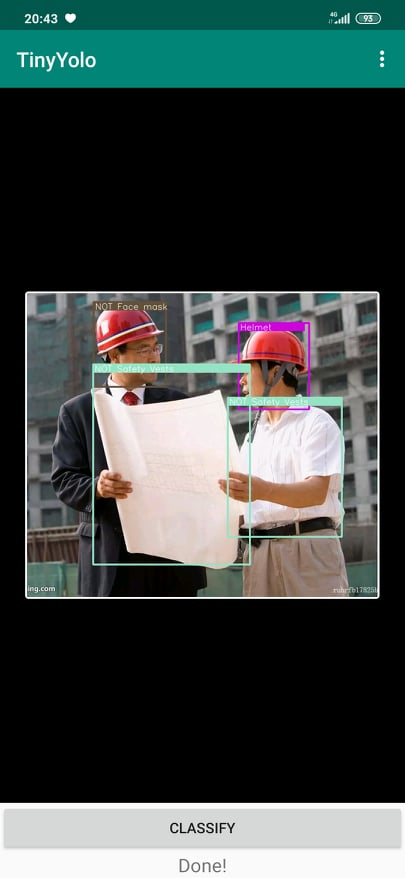

# App detect and Classifier using Yolov3 on Android 
## TOOL
- OpenCV 3.4.3
- Android Studio
- Tensorflow 1.13.1 (Should using correctly version)
- DW2TF-1.1 or DW2TF-1.2 (Don't using DW2TF-1.0)
- Yolov3 Tiny
## MAIN
### 1. Convert Yolov3-tiny model of darknet to darkflow
- clone DW2TF-1.2 (in last release) from here [DW2TF-1.2](https://github.com/jinyu121/DW2TF/releases/tag/v1.2)
Problem with DW2TF-1.0 (Yolov3, Yolov3-tiny,... be affected). What is problem? [Problem](https://github.com/jinyu121/DW2TF/issues/30)
- Download (or train) Yolov3 tiny model and config file in darknet (.cfg and .weight).
- Launch DW2TF conversion as mentioned on the github
```python3
python3 main.py \
--cfg 'data/yolov3-tiny.cfg' \
--weights 'data/yolov3-tiny.weights' \
--output 'data/' \
--prefix 'yolov3-tiny/' \
--gpu 0
```
- Conver Darkflow to tensorflow for android. Launch freeze_graph to have a single bp graph file:
```python3
freeze_graph \
--input_graph yolov3-tiny.pb \
--input_checkpoint yolov3-tiny.ckpt \
--input_binary=true \
--output_graph=ultimate_yolov3-tiny.bp \
--output_node_names="yolov3-tiny/convolutional10/BiasAdd, yolov3-tiny/convolutional13/BiasAdd"
```
- Note: 
For older version of Yolo you can use darkflow tool [Order](https://github.com/thtrieu/darkflow),Load:
```python3
./flow --model ../data/yolov2-tiny.cfg --load ../data/yolov2-tiny.weights --savepb
```
You can download [Yolo](https://pjreddie.com/darknet/yolo/) at offical page

### 2. Java code in android
#### Add package nesscessary
- build.gradle(Module: App)
```java
.....
repositories {
    maven {
        url 'https://google.bintray.com/tensorflow'
    }
}
dependencies {
    implementation fileTree(dir: "libs", include: ["*.jar"])
    implementation 'androidx.appcompat:appcompat:1.2.0'
    implementation 'androidx.constraintlayout:constraintlayout:2.0.4'
    testImplementation 'junit:junit:4.12'
    androidTestImplementation 'androidx.test.ext:junit:1.1.2'
    androidTestImplementation 'androidx.test.espresso:espresso-core:3.3.0'
    //implementation 'com.android.support:appcompat-v7:27.1.1'
    implementation 'com.android.support.constraint:constraint-layout:1.1.3'
    testImplementation 'junit:junit:4.12'
    androidTestImplementation 'com.android.support.test:runner:1.0.2'
    androidTestImplementation 'com.android.support.test.espresso:espresso-core:3.0.2'
//    androidTestImplementation 'androidx.test.espresso:espresso-core:3.1.1'
//    androidTestImplementation 'androidx.test:runner:1.1.1'
    androidTestImplementation 'androidx.test:rules:1.1.1'
    implementation 'org.tensorflow:tensorflow-android:1.13.1'
    implementation 'org.apache.commons:commons-lang3:3.0'
    implementation project(':openCVLibrary343')
}
```
- settings.gradle( Project setting)
```java
include ':app'
rootProject.name = "TinyYolo"
include ':openCVLibrary343'
```
#### Open some manefests necessary
```java
 <uses-permission android:name="android.permission.WRITE_EXTERNAL_STORAGE"/>
    <uses-permission android:name="android.permission.READ_EXTERNAL_STORAGE"/>
    <uses-permission android:name="android.permission.CAMERA"/>
    <uses-feature android:name="android.hardware.camera" android:required="false"/>
    <uses-feature android:name="android.hardware.camera.autofocus" android:required="false"/>
    <uses-feature android:name="android.hardware.camera.front" android:required="false"/>
    <uses-feature android:name="android.hardware.camera.front.autofocus" android:required="false"/>
```
#### RecognizeImage using tensorflow in Java
    to be Update
#### YoloV3-tiny in Java
    to be Update
### 3. Result
- App identifies and classifies correctly, but lacks
<p align="center">
  
</p>
<p align="center">
  
</p>